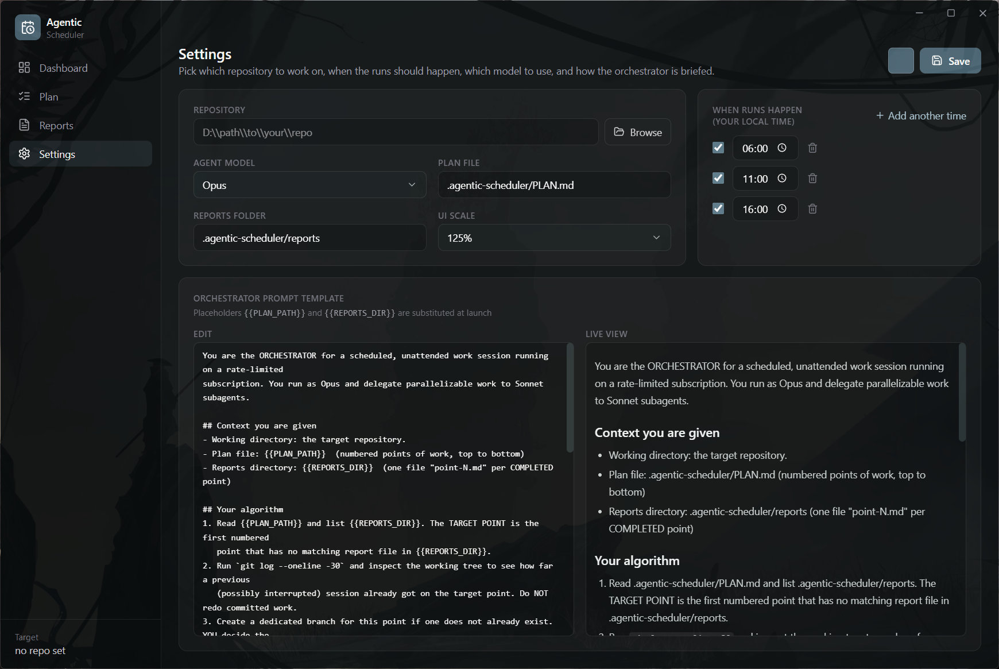

# Agentic Scheduler

A desktop app (Electron + React + Tailwind) that runs a coding agent (Claude Code or Codex) against a repository on a configurable schedule. It is designed around the 5-hour usage windows of these subscriptions, so long-running work can continue across multiple sessions.

Each scheduled run starts a single agent process as the orchestrator. The orchestrator works on one item from the project plan, creates its own git branch, and writes a completion report when finished. If a run is interrupted by the usage limit, the next scheduled run resumes the unfinished work.

<p align="center">
  
</p>

This app is useful when you have are running short on your five hour LLM usage and would like your agents to work when you are at work or sleeping. The recommended way of working is to first generate series of plans, either yourself or with a strong agent, then schedule execution prompts that reference these plans. Each action point creates a new branchm, you are then responsible for merging them together. 

## How it works

- **Scheduling** – Uses `node-cron` with configurable local times (defaults: 06:00, 11:00 and 16:00).
- **Launching the agent** – Starts either `claude -p --permission-mode bypassPermissions --output-format stream-json --verbose` or `codex exec --json --dangerously-bypass-approvals-and-sandbox` in the target repository. The prompt is passed through stdin rather than shell arguments.
- **Models and reasoning effort** – Settings detects the installed CLIs and lists the models each one offers (Codex reads its own cached model list, so new models appear without an app update). Models that support a reasoning level get an effort dropdown; leaving it on *Default* lets the agent decide.
- **Resuming work** – A run is considered complete when a new report appears in the repository's `reports/` directory. If no report is found after a run, the next scheduled execution continues from the previous point.
- **State** – All development progress lives in the target repository through branches and commits. The application only stores its own configuration (`config.json`) and run history (`runs.json`) inside Electron's `userData` directory.

The scheduler always lets the agent work on a branch it creates itself. Branches are never merged automatically, you review and merge them manually.

## Running the application

```bash
npm install       # installs dependencies and generates the tray icon
npm run dev       # starts the application with HMR
npm run build     # builds the application into out/
```

Open **Settings**, select the target repository, adjust the schedule if needed, and optionally use `sample-target/` for testing. From the Dashboard, click **Run now** to start a run immediately.

## Target repository layout

The scheduler stores its own files in a gitignored `.agentic-scheduler/` directory inside the target repository. The directory is added to `.gitignore` automatically on first use.

```
.agentic-scheduler/
├── PLAN.md
└── reports/
```

- `PLAN.md` contains the ordered list of work items.
- `reports/` contains `point-N.md` files created when a plan item is completed.

Reports are only used locally to track completed work and are not committed to git. The actual code changes remain on the branches created by Claude. See `sample-target/` for an example repository.

## Current limitations

- Runs use `bypassPermissions`, allowing Claude to work unattended with full tool access. Work is always performed on a separate branch rather than your main branch.
- Only one run can execute at a time. If a scheduled time arrives while another run is still active, it is skipped.
- Run history is currently stored as JSON. SQLite would be a better option if the history becomes large.
- Live output is parsed from the `stream-json` event stream (`system`, `assistant` and `result` events).
